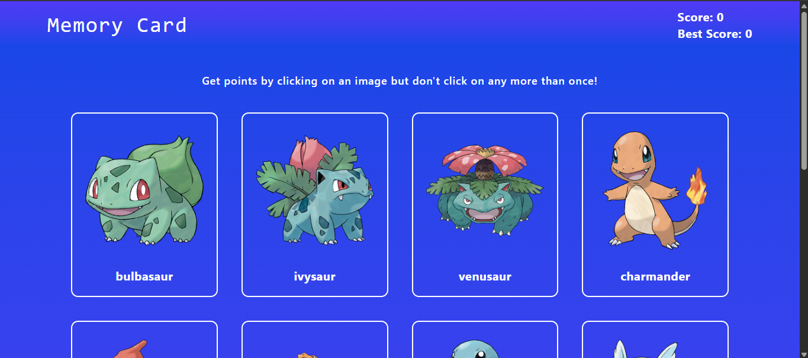

# 🧠 Memory Card Game - Pokémon Edition

  
_Minimalist UI with dynamic gameplay using React & Tailwind_

## 🌟 Live Demo

Play it here: [https://memory-card-odin-xi.vercel.app/](https://memory-card-odin-xi.vercel.app/)

## ✨ Overview

A fast-paced memory game built using React and powered by the PokeAPI. The challenge? Click each Pokémon only once! Every correct click increases your score, but one wrong move resets it all. The cards shuffle dynamically on every click to keep you guessing!

## 🔥 Key Features

| Feature                    | Description                                                              |
| -------------------------- | ------------------------------------------------------------------------ |
| **Dynamic Card Shuffling** | Cards reshuffle after every click to test memory                         |
| **Score Tracking**         | Tracks current score and best score                                      |
| **API Integration**        | Pokémon images and names fetched from PokeAPI                            |
| **Minimalist UI**          | Clean and intuitive layout with responsive feedback                      |
| **Hook-Based Logic**       | State and side-effects managed via React Hooks (`useState`, `useEffect`) |

## 🛠️ Tech Stack

### Frontend

- **Framework**: React 18
- **Styling**: Tailwind CSS
- **Data**: [PokeAPI](https://pokeapi.co/)
- **Logic**: React Hooks (`useEffect`, `useState`)

### Deployment

- **Hosting**: Vercel
- **CI/CD**: GitHub Actions

## 🚀 Getting Started

1. **Clone the Repository**
   ```bash
   git clone https://github.com/your-username/memory-card-game.git
   cd memory-card-game
   ```
